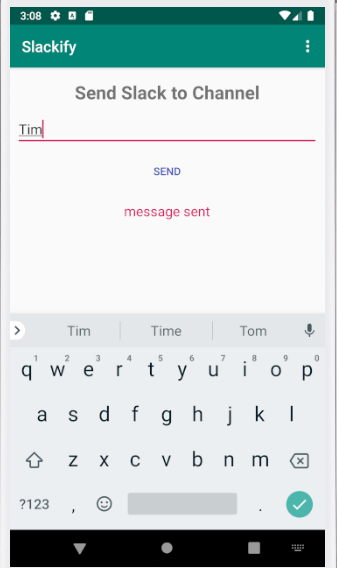

# example-slack-notification
Illustrates how notifications from an app can be sent to a slack channel.

## Screenshots
- Interface of the android application

- Sample notification from Slack

## Blog Post
More info about this application is provided in a blog post [here](https://medium.com/@timothy.mubiru/sending-app-updates-to-a-slack-channel-873851fed46a?postPublishedType=initial).